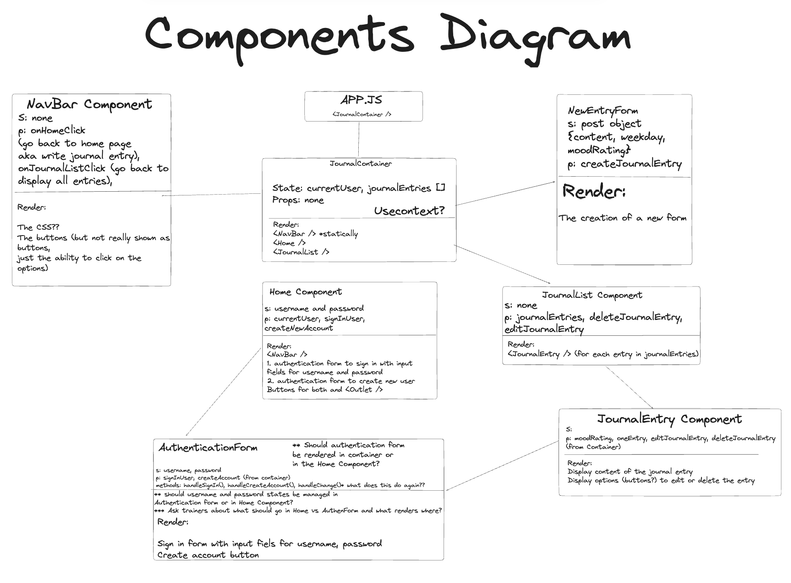

# The Positivity Pathfinders are proud to present: 
# ☮️ The Gratitude Journal FrontEnd Project! ☮️

## Our Mission
MAPPING the ROUTE to grateful living

## The Team
* Janet Mensah
* Thomas Loughran
* Annie Wilson
* Hezekiah Adeusi

## The Project's Aims:
### For Users:
* To provide our users with a space to log their gratitudes, hardships and goals for the future.
### For Developers:
* To build on our working knowledge and skills of the React framework/library through implementation and utilisation of forms and React libraries such as React Pro Sidebar and React Icon, and more.

### How to use the Website:
* Download our app (coming soon!)
* Fork this repo and clone locally to your terminal.
* Run the API and the client project file locally.
* If you're a new user, create an account by inputting your name and email.
* If you're an existing user, just click on the sign in button and input your details.
* Once you're signed in, you should be able to create a new journal entry, view all your entries and also edit or delete any entry in the list.
* Once you've finished logging all of your day (or week...or year!)'s happenings, remember to sign out!
* If you've decided you no longer require a journal to document your thoughts, you can delete your account (but we'll be sad to see you go 😢!)

## Dependencies/Required Installs
* npm i react-pro-sidebar react-icons
* npm install react-pro-sidebar
* npm install @mui/material @emotion/react @emotion/styled
* npm i react-router-dom

## MVP
* Ability for user to sign in or create account ✅
* Ability for user to create a new journal entry ✅
* Ability for user to view, edit or delete all journal entries ✅
* Ability for user to sign out ✅

## Extensions
* Beautiful CSS ✅
* Enable user to delete their account ✅
* Enabling password matching function (not encryption) when user signs in or creates account with name, email and password ⏸️
* Mobile friendly button that has a scroll function following the user as they navigate the page, so they can create a new journal entry from anywhere on the app ⏸️

## Diagrams
### Wireframe Diagram

## Components Diagram

